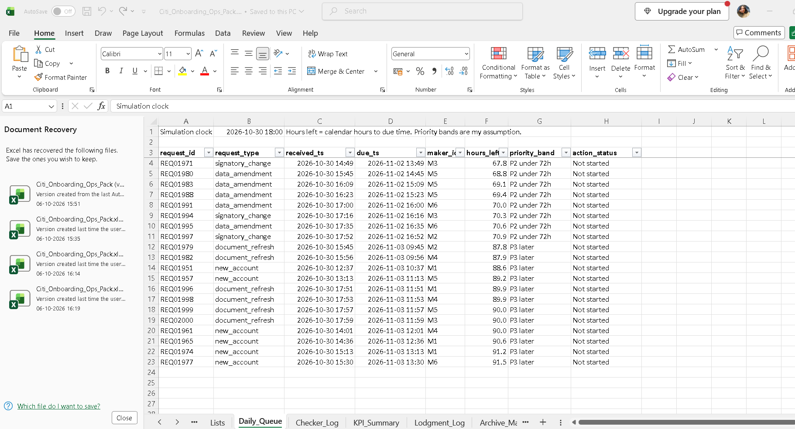
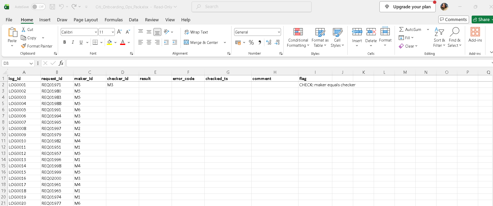
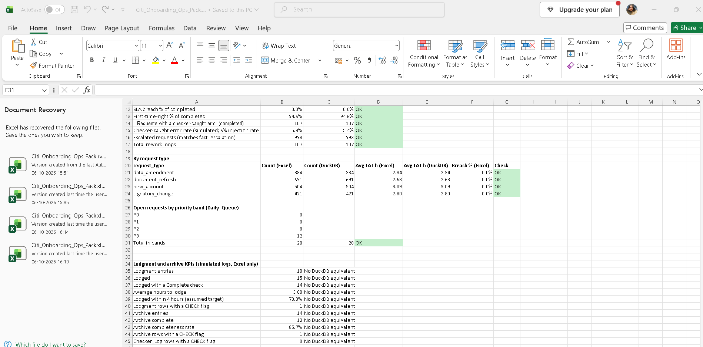
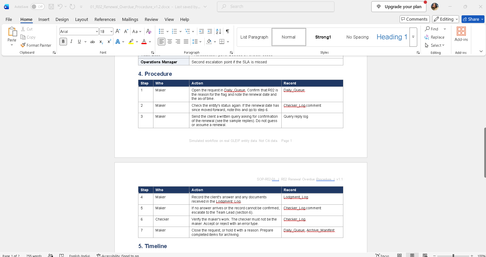

# Client Onboarding Control Simulation

A simulated client onboarding operation built on real public GLEIF entity data. It covers a maker-checker workflow, SLA tracking, escalation rules, an Excel operations pack, versioned Word procedures and a test suite.

> **Simulated workflow on real GLEIF entity data. Not bank data.** Entity records are real and public (GLEIF Golden Copy, published 2026-10-04 16:00). Requests, errors, document events, staffing, SLAs and volumes are my assumptions.

## Headline results

| Result | Label | Value |
|---|---|---|
| Control-rule hits in the 5,000-entity sample (unweighted, over-represents lapsed and retired records) | Observed from GLEIF | R01 2,466, R02 5, R03 959, R04 120, R05 349, R06 47 |
| Baseline workflow, 6 makers and 3 checkers: 2,000 requests, 1,980 completed, 20 open | Simulated | Median turnaround 1.90 h, P90 5.93 h, 0 SLA breaches, 993 escalated requests |
| Excel pack figures agree with the DuckDB tables, and the SQL metrics are re-computed in Python | Derived | KPI_Summary check cell shows ALL OK; 50 automated tests pass |

In my simulation the escalation share follows my own severity and action assumptions, so it is not a typical rate.

## What is in the project

- **Rules R01 to R07:** registration and renewal status, entity status, country mismatch, missing parent, name score against public sanctions lists (potential match for review only), and FATF-listed country. Severity, action and SLA values are my assumptions. Catalogue: `rules/onboarding_rules.md`.
- **Workflow simulation:** four request types, a shared queue engine with FIFO and priority options (`config.yaml`), 20-seed scenario comparison.
- **Excel operations pack** (`excel/Citi_Onboarding_Ops_Pack.xlsx`): Daily_Queue with priority bands, Checker_Log with a maker-checker flag, KPI_Summary checked against DuckDB, Lodgment_Log, Archive_Manifest, Reg_Watch change register and UAT_Results.
- **Word procedures** (`docs/procedures/`): signatory update, renewal-overdue rule (v1.0 and v1.1 with change record CR-001, a simulated change), escalation matrix (v1.0 and v1.1), and six sample client and internal replies.
- **Tests:** 50 pytest tests covering rules, model integrity, workflow invariants, scenarios and SQL metrics.
- **UAT:** 39 cases, all run: 37 pass, 2 fail. 21 are linked to pytest; the rest are manual Excel and document checks. Both fails are findings about the Checker_Log: it flags a checker who is the maker but does not block it (UAT22), and it accepts a maker ID as checker with no flag (UAT24).

Full write-up: [`docs/onboarding_platform.md`](docs/onboarding_platform.md).

## Screenshots

All data in these sheets is simulated.

**Daily queue.** Open requests with live hours left and priority bands.

**Maker-checker log.** A checker who is also the maker is flagged with a CHECK message.

**KPI summary.** Each Excel formula is checked against the DuckDB value.

**Procedure SOP-R02 v1.2.** The renewal-overdue procedure, with lodgment logging in step 3.

## Limits

- Not bank data and not bank policy. Rule severity, SLAs and the 4-hour lodgment target are assumed values.
- GLEIF Level 2 shows accounting consolidation, not beneficial ownership. A missing parent is not proof that none exists.
- A name match against a sanctions list is a potential match for review only, not a finding. No company names are exported.
- Lodgment_Log rows 12 to 17 and Archive_Manifest rows 14 and 15 are deliberate test cases.
- On Checker_Log, a checker who is the same person as the maker is flagged ("CHECK: maker equals checker") but not blocked. Tested in Excel on 2026-10-06. Blocking it would need a stricter validation rule or procedure.

## Reproduce

Raw GLEIF and sanctions files are not committed (see `docs/01_provenance_register.md` and `data_pointers/`). After the sample and `data/processed/` exist, run in this order:

    python scripts/build_model.py
    python scripts/build_parents.py
    python scripts/build_screen.py
    python scripts/build_rules.py
    python scripts/build_workflow.py
    python scripts/build_clock.py
    python scripts/build_scenarios.py
    python scripts/build_seeds.py
    python -m pytest tests -q

---

## Project 2: Sanctions & PEP Screening with Risk-Based Due Diligence

A simulation of a bank's KYC screening flow on public OFAC / UN / EU sanctions
lists: name matching, risk tiering, CDD/EDD escalation, beneficial-ownership
resolution and periodic review scheduling.

> **This is a simulation on public and synthetic data. It is not a compliance
> system and has no legal authority.**

Start with the write-up: [`docs/kyc_aml_program_note.md`](docs/kyc_aml_program_note.md)

## Headline results
Evaluated on 926 labelled names (360 true matches, 180 near-misses, 386 true negatives):

| Threshold | Recall | Precision | False-positive rate |
|---|---|---|---|
| 75 | 94.7% | 73.0% | 22.3% |
| 80 | 92.2% | 85.8% | 9.7% |
| 85 | 80.3% | 93.5% | 3.5% |

The near-miss set is a deliberate stress test, so these false-positive rates are
worse than a real customer base would give.

## What is real and what is synthetic
| Real, public | Synthetic (clearly labelled) |
|---|---|
| OFAC SDN list, UN consolidated list, EU consolidated list | Test-name variants and near-misses |
| FATF lists (19 June 2026) | Customer country, PEP flags, review dates |
| SEC EDGAR company names (true negatives) | 51 ownership structures |

## Repository layout
    data_pointers/   where the data comes from, plus the generated test set
    sql/             entity-resolution, ranking and review queries
    src/             ingest, build_testset, match, risk_scoring, escalation, ubo, triage
    rules/           risk scoring catalogue, CDD/EDD thresholds, review schedule, FATF lists
    docs/            program note, methodology, regulatory basis, limitations, outputs
    notebooks/       exploration
    dashboard/       reserved for the dashboard

## Reproduce
Raw lists are not committed. Download them as described in `data_pointers/`,
then run in this order:

    pip install pandas rapidfuzz jellyfish networkx duckdb
    python src/ingest.py
    python src/build_testset.py
    python src/match.py
    python src/risk_scoring.py
    python src/escalation.py
    python src/ubo.py
    python src/triage.py 
    python src/run_sql.py

Random seeds are fixed, so the test set and results are reproducible.

SQL analysis: `python src/run_sql.py` runs six DuckDB queries over the processed files and saves the results to `docs/sql_results/`.

## Limitations
See [`docs/limitations.md`](docs/limitations.md): synthetic customers and
ownership, a rule-generated test set with no hold-out, no transliteration
handling, name-only matching, and ownership based on percentage only.
